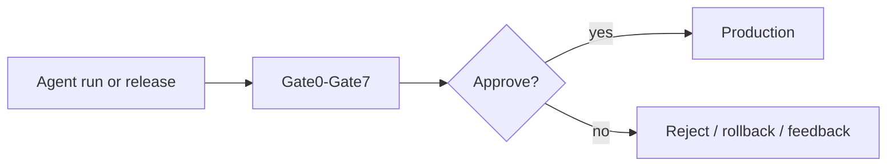
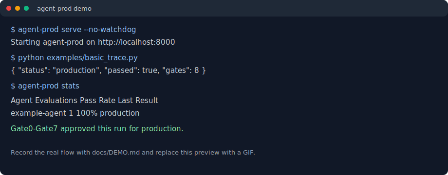

# agent-prod

[English](README.md) | [简体中文](README.zh-CN.md) | [Demo guide](docs/DEMO.md) | [Usage](docs/USAGE.md)

**SonarQube for production AI agents.** agent-prod is a quality gate and risk
control layer that decides whether an AI agent run, version, or release is safe
enough for production.

OctoBus is the agent gateway. agent-prod is the agent quality layer. If OctoBus
is "nginx for agents", agent-prod is "SonarQube for agents": it checks the
behavior, trace, cost, release state, audit context, answer quality, and
execution consistency before production traffic sees the agent.

Kubernetes' moat is not one scheduler implementation; it is the CRI/CNI/CSI
interface design. agent-prod's moat is the quality-gate interface: Gate ABCs,
Gate0-Gate7 lifecycle, attribution, regression baselines, and release-state
semantics.

## Proof Points

| Signal | Evidence |
|---|---|
| 156 real sessions | Validated against real Hermes Agent sessions |
| 4,345 tool calls | Used to exercise tool-risk and trace-integrity paths |
| 3 models | Covered `feature/deepseek`, `lite v4-flash`, and `v4-flash` traces |
| 186 tests | Current CI passes without warnings |

## How It Works



Gate0-Gate7 covers permission checks, budget control, trace integrity,
regression detection, gray release, audit, LLM answer quality, and execution
consistency.

## One-Line Integration

```python
from agent_prod import trace

result = trace(
    agent="my-agent",
    session_id="session-001",
    current_metrics={"final_response": "Paris", "success_rate": 0.99},
)
```

## MCP Server

agent-prod exposes all 8 quality gates (Gate0–Gate7) as [MCP](https://modelcontextprotocol.io) tools,
so any MCP-compatible agent (Claude Desktop, Cursor, Cline, etc.) can call quality-gate
evaluations directly.

```bash
# Install with MCP support
pip install "agent-prod[mcp]"

# Start the MCP server
agent-prod-mcp
```

### Available Tools

| Tool | Description |
|---|---|
| `evaluate_trace` | Full Gate0–Gate7 quality gate evaluation for an agent trace |
| `check_tool_safety` | Single tool-call Gate0 preflight check — call before invoking risky tools |
| `get_gate_stats` | Query historical evaluation stats |
| `health_check` | Engine and repository health check |

### Claude Desktop Configuration

Add to your `claude_desktop_config.json`:

```json
{
  "mcpServers": {
    "agent-prod": {
      "command": "agent-prod-mcp"
    }
  }
}
```

> **Note:** The `config.yaml` storage backend defaults to `file` for persistence.
> Set `AGENT_PROD_REPO` environment variable to customise the data path.

## Quick Demo

```bash
pip install agent-prod
agent-prod configure
agent-prod serve

python examples/basic_trace.py
agent-prod stats
```



For a 15-second terminal recording script, see [docs/DEMO.md](docs/DEMO.md).

## Different From Existing Agent Projects

| Project type | What it does | Where agent-prod fits |
|---|---|---|
| LangChain / CrewAI / AutoGen | Build and orchestrate agents | Controls production risk after agents are built |
| OctoBus | Exposes services to agents through a gateway | Complements it with behavior and release quality gates |
| Eval frameworks | Run offline tests | Gates live runs, versions, regressions, and rollouts |
| Observability tools | Monitor what happened | Approves, rejects, rolls back, and generates feedback |

## Start Here

- [Examples](examples/) - runnable traces and release scenarios
- [Usage guide](docs/USAGE.md) - CLI, configuration, and Gate0-Gate7 details
- [Discovery copy](docs/DISCOVERY.md) - multilingual descriptions and keywords
- [Comparison analysis](COMPARISON_ANALYSIS.md) - OctoBus / agent-compose / agent-prod positioning
- [Roadmap](ROADMAP.md) - production validation plan and next proof points

## License

MIT License. See [LICENSE](LICENSE).
