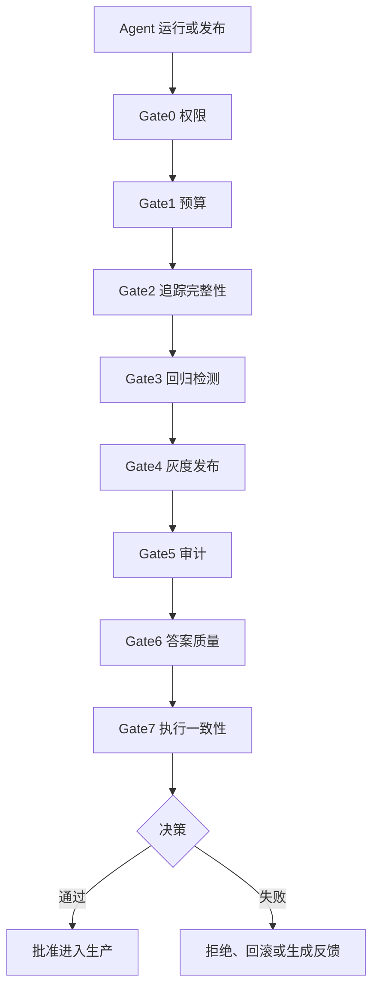

# agent-prod — 面向生产环境的 AI Agent 质量门禁与风控框架

[English](README.md) | [简体中文](README.zh-CN.md)

agent-prod 是一个面向生产环境的 LLMOps 框架，用于 **AI Agent 评估、质量门禁、风险控制、回归检测、灰度发布、审计和可观测性**。

它解决的问题不是“如何构建 Agent”，而是“一个 Agent 运行、版本或发布是否足够安全，可以进入生产环境”。

## 为什么需要 agent-prod?

大多数 Agent 框架关注构建和编排 Agent。agent-prod 关注的是 Agent 上线前和运行中的生产风险控制。

它会在批准一次 Agent 运行或发布前检查：

- 权限和工具调用风险
- Token 与时间预算
- LLM 与工具调用链路完整性
- 相比历史基线的性能和质量回归
- 灰度发布状态
- 审计要求
- LLM 答案质量
- 执行计划、输出与目标的一致性

## 架构



## 和其他项目有什么不同?

| 项目类型 | 主要关注点 | agent-prod 的区别 |
|---|---|---|
| LangChain / CrewAI / AutoGen | 构建和编排 Agent | 在 Agent 构建完成后控制生产风险 |
| Eval 框架 | 离线评估 | 门禁真实运行、版本发布、回归和灰度决策 |
| 可观测性工具 | 监控行为 | 可以批准、拒绝、回滚并生成改进反馈 |
| CI 工具 | 测试代码 | 测试 Agent 行为、工具调用、成本、追踪质量和答案质量 |

## 快速开始

```bash
pip install agent-prod
agent-prod configure
agent-prod serve
```

## 一行代码接入自研 Agent

```python
from agent_prod import trace

result = trace(
    agent="my-custom-agent",
    session_id="session_001",
    decisions=[{
        "decision_id": "d1",
        "model": "gpt-4",
        "prompt_tokens": 100,
        "completion_tokens": 50,
        "tool_calls": [{
            "tool_id": "t1",
            "tool_name": "search",
            "arguments": {"query": "weather"},
            "result_summary": "Sunny, 22C",
            "success": True,
            "duration_ms": 120.0,
        }],
    }],
    current_metrics={
        "final_response": "Sunny, 22C",
        "latency_p95_ms": 300,
        "success_rate": 0.99,
    },
)

print(result)
```

## 关键词

AI Agent 质量门禁、智能体风控、智能体评估、大模型评估、LLMOps、智能体治理、回归检测、灰度发布、审计、可观测性、生产级 AI Agent。

## 示例

查看 [examples](examples/) 获取基础 trace、答案质量检查、回归检测和灰度发布示例。

## License

MIT License. See [LICENSE](LICENSE).
